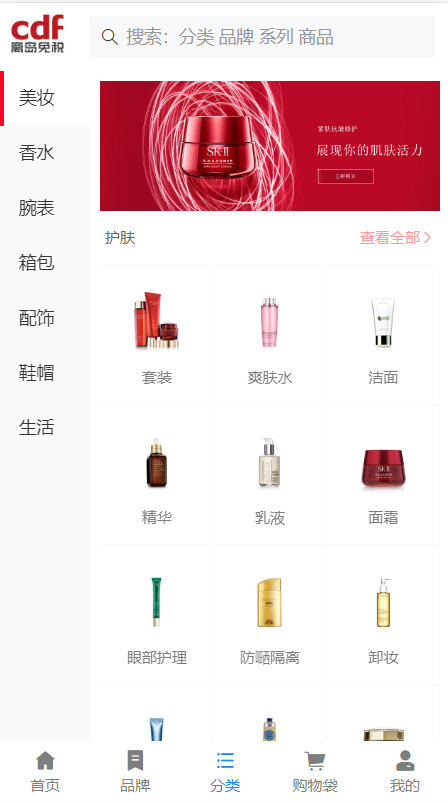
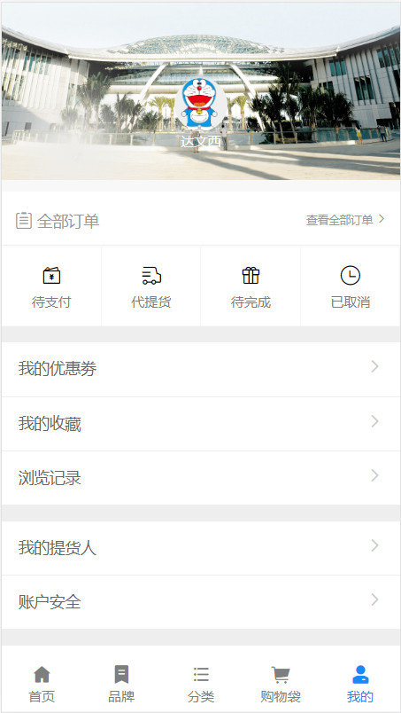
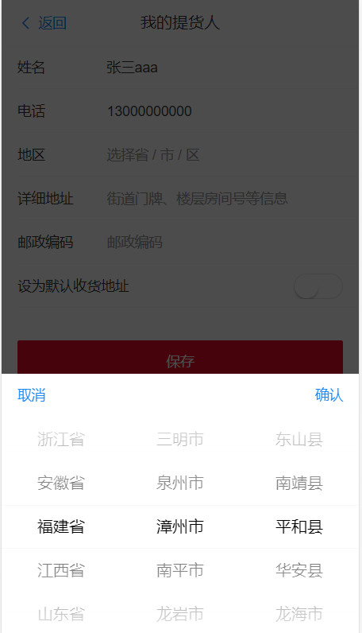
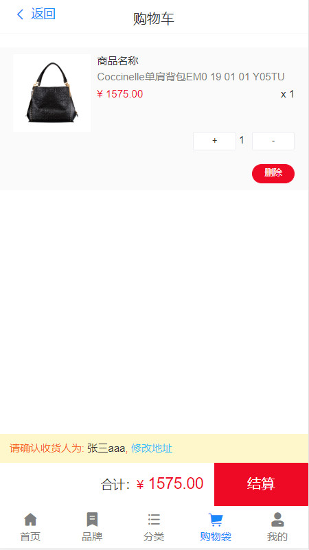
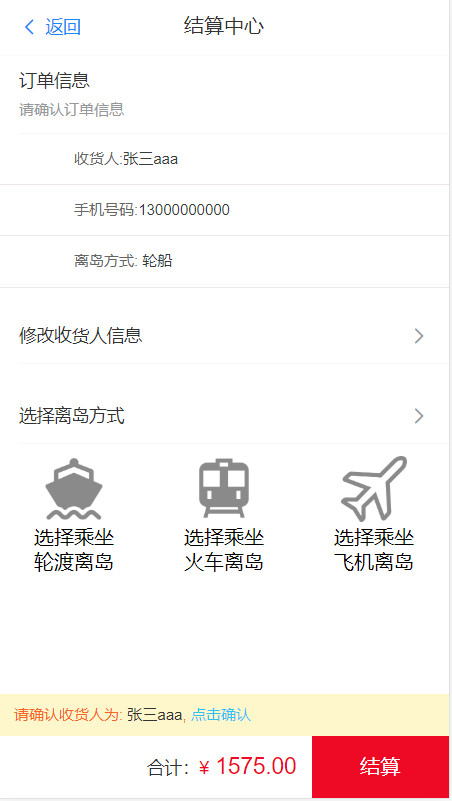

## 离岛代购

###    	使用vue开发的一个移动端项目，主要功能有登录注册，商品浏览，查看详情，添加收货人，切换地址，添加购物车，提交订单等功能。

#### 		主要技术：使用vue-cli4脚手架开发，vue实现组件化开发，vuex实现数据双向绑定，vur.$router实现页面切换，引用了vant-ui与cube-ui实现部分组件,使用webpack打包工具将项目打包，并部署上线 http://180.76.107.134:3000

##### 主要页面展示

###### 引导页

###### 首页 

`											

​											 

##### 查看详情

##### 修改地址

​											 					·	 
​	

##### 添加购物车

##### 结算
​											 

